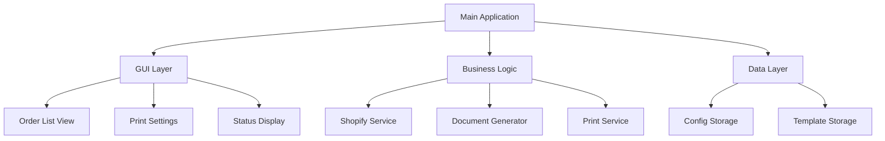

# Shopify Order Print System
## Project Planning Document

### Project Overview
The Shopify Order Print System is a Windows desktop application designed to streamline the order fulfillment process by automatically generating and printing pick tickets and other order-related documents from Shopify orders. The application will be built using Python with a native Windows interface, making it easy to deploy and maintain across multiple workstations.

### Core Requirements

#### Functional Requirements
1. **Authentication & Setup**
   - First-time setup wizard for Shopify API credentials
   - Secure storage of authentication tokens

2. **Order Management**
   - Fetch orders from Shopify that are not tagged as "printed" of fetch orders by date range (GraphQL Query)
   - Display orders in a sortable table view
   - Support for bulk selection of orders
   - Automatic order tagging after printing (optional checkbox, tag as "printed" -- GraphQL mutation)

3. **Document Generation**
   - Generate pick tickets in PDF format
   - One order per page
   - Include all relevant order details:
     - Order number
     - Customer information
     - Line items with quantities
     - SKUs
     - Inventory locations
   - Support for additional document templates (future capability)

4. **Printing**
   - Native Windows print dialog integration
   - Batch printing support
   - Print preview capability
   - Default printer selection

#### Technical Requirements
1. **Development**
   - Python 3.x
   - PySide6 for GUI
   - WeasyPrint for PDF generation from HTML/CSS templates
   - Jinja2 for HTML templating
   - Shopify GraphQL API integration
   - Git version control + GitHub

2. **Deployment**
   - Compiled executable (.exe)
   - Simple installation process
   - Minimal dependencies
   - Support for Windows 10/11 & Linux

### Implementation Phases

#### Phase 1: Core Framework (Week 1-2)
- [ ] Project setup and repository creation
- [ ] Basic GUI implementation
- [ ] Shopify API integration
- [ ] Authentication system
- [ ] Order fetching and display

#### Phase 2: Document Generation (Week 3)
- [ ] HTML/CSS template creation
   - Pick ticket base template
   - CSS Styling for print optimization
   - Template preview system
- [ ] PDF generation implementation
- [ ] Print system integration
- [ ] Basic error handling

#### Phase 3: Order Processing (Week 4)
- [ ] Order tagging system
- [ ] Bulk processing
- [ ] Status updates
- [ ] Progress indicators

#### Phase 4: Testing & Deployment (Week 5)
- [ ] User acceptance testing
- [ ] Bug fixes and optimizations
- [ ] Deployment package creation
- [ ] Documentation
- [ ] Staff training

### Technical Architecture

### Document Generation System

1. **Template Structure**
   - HTML Templates using Jinja2
   - Seperate CSS file for styling
   - Print Specific css rules
   - Support for multipage page layouts

2. **Key Features**
   - Live template preview
   - Custom CSS for different doc types
   - Print Optimizations
   - Page break controls
   - Layouts for 8.5x11 paper

3. **Template Management**
   - Version Controlled Templates
   - Easy template modification
   - Style Inheritence
   - Component reusability

### Risk Assessment

1. **Technical Risks**
   - Shopify API changes
   - Printer compatibility issues
   - PDF generation performance
   
2. **Mitigation Strategies**
   - Version control for API integration
   - Extensive printer testing
   - Performance optimization for large batches
   - Regular backups of configuration

### Success Criteria
1. Successfully fetch and display orders from Shopify
2. Generate accurate pick tickets
3. Process orders in batch without errors
4. Maintain system performance with large order volumes
5. User-friendly interface requiring minimal training
6. Reliable printer integration
7. Secure credential storage

### Future Enhancements
1. Additional document templates
2. Custom tag management
4. Enhanced filtering options
5. Automated testing
6. Reporting features
7. Batch size configuration

### Resource Requirements
1. **Development**
   - Python developer
   - Access to test Shopify store
   - Windows development machine
   
2. **Testing**
   - Test environment
   - Sample order data
   - Various printer configurations

3. **Deployment**
   - Target workstations
   - Network access
   - Printer setup

### Timeline
- **Week 1-2**: Core Framework
- **Week 3**: Document Generation
- **Week 4**: Order Processing
- **Week 5**: Testing & Deployment
- **Week 6**: Training & Handover

### Budget Considerations
1. **Development Costs**
   - Developer time
   - Software licenses
   - Testing resources

2. **Operational Costs**
   - Shopify API usage
   - Maintenance
   - Support

### Next Steps
1. Review and approve project scope
2. Confirm technical requirements
3. Establish development environment
4. Create detailed sprint plans
5. Begin Phase 1 implementation

*Document Version: 1.0*
*Last Updated: 11-08-2024*